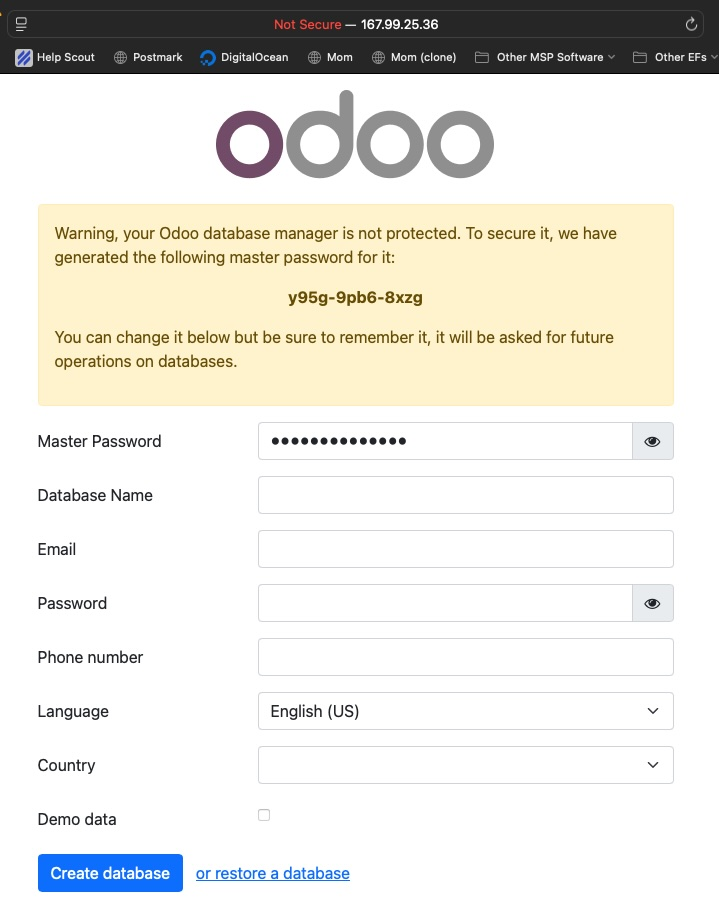

# odoo-k8s

Testing out odoo Kubernetes deployment

- [odoo-k8s](#odoo-k8s)
  - [Setup](#setup)

## Setup

Create a kubernetes cluster via the DigitalOcean control panel:
https://cloud.digitalocean.com/kubernetes/clusters?i=97cc3d

Then run the following shell commands:

```
doctl auth init --context mycontext
doctl kubernetes cluster kubeconfig save odoo --context mycontext
kubectl create namespace odoo
kubectl apply -f postgres.yml
kubectl apply -f odoo.yaml
```

Check pod status until both pods are status `Running`:

```
$ kubectl -n odoo get pods
NAME                             READY   STATUS              RESTARTS   AGE
odoo-7b4db4d454-jcjdd            0/1     ContainerCreating   0          62s
odoo-postgres-675dc5b477-9kx57   1/1     Running             0          66s
...
$ kubectl -n odoo get pods
NAME                             READY   STATUS    RESTARTS   AGE
odoo-7b4db4d454-jcjdd            1/1     Running   0          76s
odoo-postgres-675dc5b477-9kx57   1/1     Running   0          80s
```

Get the external IP by running the following command until `EXTERNAL-IP` is no longer `<pending>`:

```
$ kubectl -n odoo get svc
NAME            TYPE           CLUSTER-IP      EXTERNAL-IP   PORT(S)        AGE
odoo            LoadBalancer   10.109.2.31     <pending>     80:31395/TCP   2m31s
odoo-postgres   ClusterIP      10.109.29.217   <none>        5432/TCP       2m35s
...
$ kubectl -n odoo get svc
NAME            TYPE           CLUSTER-IP      EXTERNAL-IP    PORT(S)        AGE
odoo            LoadBalancer   10.109.2.31     167.99.25.36   80:31395/TCP   2m59s
odoo-postgres   ClusterIP      10.109.29.217   <none>         5432/TCP       3m3s
```

Then navigate to the external IP in the browser:


